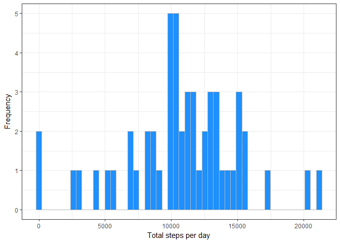
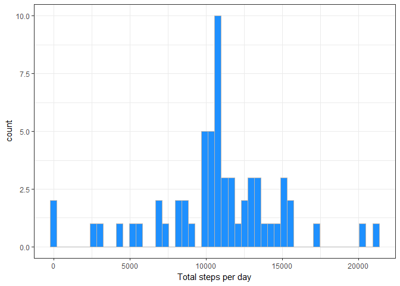
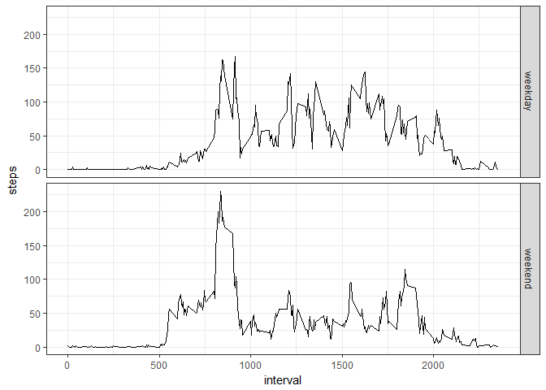

# Reproducible Research: Peer Assessment 1


# Loading and preprocessing the data

```r
library(ggplot2)

# unzip the files
unzip("./activity.zip",exdir=".")

# raw data set
dat <- read.csv("./activity.csv")

# data set with no missing values
datc <- dat[complete.cases(dat),]
```


# What is mean total number of steps taken per day?

### Total nr of steps per day

```r
stepsDay <- aggregate(datc$steps, by = list(datc$date), FUN = sum)
names(stepsDay) <- c("date", "totalsteps")
```


### Histogram

```r
ggplot(stepsDay, aes(totalsteps)) + 
          geom_histogram(bins = 50, fill = "dodgerblue", col = "gray71") + 
          theme_bw() + 
          xlab("Total steps per day") +
          ylab("Frequency")
```

<!-- -->

### Mean and median of total nr of steps taken per day

```r
meanTotal <- mean(stepsDay$totalsteps)
meanTotal
```

```
## [1] 10766.19
```

```r
medianTotal <- median(stepsDay$totalsteps)
medianTotal
```

```
## [1] 10765
```

  
    
# What is the average daily activity pattern?

### Calculate average steps during interval

```r
stepsInterval <- aggregate(datc$steps, by = list(datc$interval), FUN = mean)
names(stepsInterval) <- c("interval", "meansteps")
```

### Time series plot of average steps agains time interval (average of all days)

```r
ggplot(stepsInterval, aes(x = interval, y = meansteps)) + 
          geom_line(col = "blue") + 
          theme_bw() + 
          ylab("Average steps") + 
          xlab("Time interval")
```

<!-- -->


### Time interval containing maximum number of steps

```r
stepsInterval$interval[which.max(stepsInterval$meansteps)]
```

```
## [1] 835
```


# Imputing missing values

### Total number of rows with NAs

```r
sum(is.na(dat))
```

```
## [1] 2304
```


### Imputing missing values using mean of interval

```r
# Vector containing average nr of steps per interval repeated to be 
# of same length as dat
meanStepsN <- rep(stepsInterval$meansteps, times = length(levels(dat$date)))

# loop through all days: creating new data set with no missing values
dati <- dat;
for(j in 1:nrow(dati)){
          if(is.na(dati$steps[j])){
                    dati$steps[j] <- meanStepsN[j]
          }
}
```

### Total nr of steps per day with new data set

```r
stepsDayi <- aggregate(dati$steps, by = list(dati$date), FUN = sum)
names(stepsDayi) <- c("date", "totalsteps")
```

### Histogram of total nr of steps with new data set

```r
ggplot(stepsDayi, aes(totalsteps)) + 
          geom_histogram(bins = 50, fill = "dodgerblue", col = "gray71") + 
          theme_bw() + 
          xlab("Total steps per day")
```

<!-- -->

### Mean and median of total nr of steps taken per day

```r
meanTotali <- mean(stepsDayi$totalsteps)
meanTotali
```

```
## [1] 10766.19
```

```r
medianTotali <- median(stepsDayi$totalsteps)
medianTotali
```

```
## [1] 10766.19
```


### How do the mean and median differ?

```r
# difference in mean (absolute)
meanTotal - meanTotali
```

```
## [1] 0
```

```r
# difference in mean (percentage)
100*(meanTotal - meanTotali)/meanTotal
```

```
## [1] 0
```

```r
# difference in median (absolute)
medianTotal - medianTotali
```

```
## [1] -1.188679
```

```r
# difference in mean (percentage)
100*(medianTotal - medianTotali)/medianTotal
```

```
## [1] -0.01104207
```


# Are there differences in activity patterns between weekdays and weekends?


### Create new factor variable

```r
dati$day <- weekdays(as.Date(dati$date))
                     
dati$weekday <- ifelse(dati$day %in% c("zaterdag","zondag"), 0,1)                     
```


## First calculate average nr of steps for weekday and weekend

```r
# frist split the data
datWeekday <- split(dati,dati$weekday)

# calculate average nr of steps for weekday
stepsWeekday <- aggregate(datWeekday[[1]][1], by = datWeekday[[1]][3], FUN = mean)
stepsWeekday$week <- as.factor("weekday")

# calculate average nr of steps for weekend
stepsWeekend <- aggregate(datWeekday[[2]][1], by = datWeekday[[2]][3], FUN = mean)
stepsWeekend$week <- as.factor("weekend")

# combine both data frames
stepsIntervali <- rbind(stepsWeekday,stepsWeekend)
```


## Panel plot

```r
ggplot(stepsIntervali, aes(interval,steps)) + 
          geom_line() +
          facet_grid(week ~.)+
          theme_bw()
```

<!-- -->


